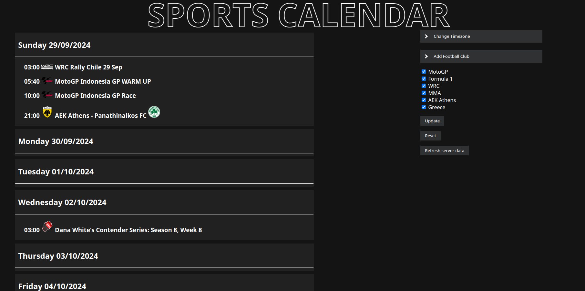

# SportsCalendar
<p align="center">
  
</p>

A common calendar for many different sports.
## Local Setup

You can test this locally by setting up a python virtual environment and using a local flask instance.

```bash
git clone https://github.com/dBangos/SportsCalendar.git
cd SportsCalendar
python3 -m venv venv
source venv/bin/activate
pip install -r requirements.txt
flask --app main.py run --host=0.0.0.0
```
